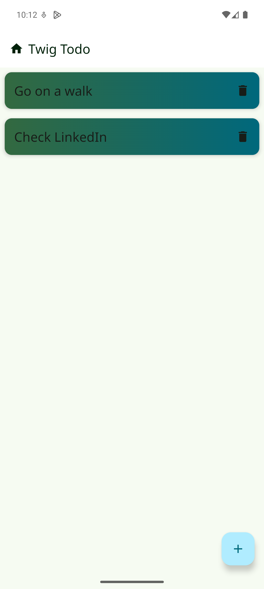
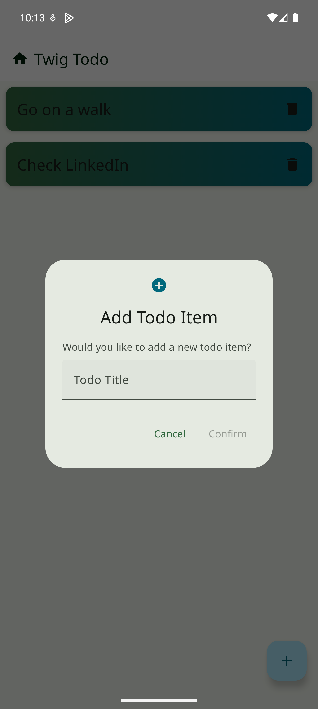

# Twig To-Do
A simple To-do app in android built with MVVM best practices, Room, and Compose.

## Architecture

This app built using MVVM, using Room as the database manager and Koin as the dependency injection.

The data flow is as follows:

Database -> DTO Object -> Repository -> Domain Object -> View Model -> View

For the ToDo list itself, the database is the ultimate source of truth, and the repository
provides a listener for the view to listen on.

## Testing

Just viewmodels have been unit testing using Junit4 and mockk. Please see .